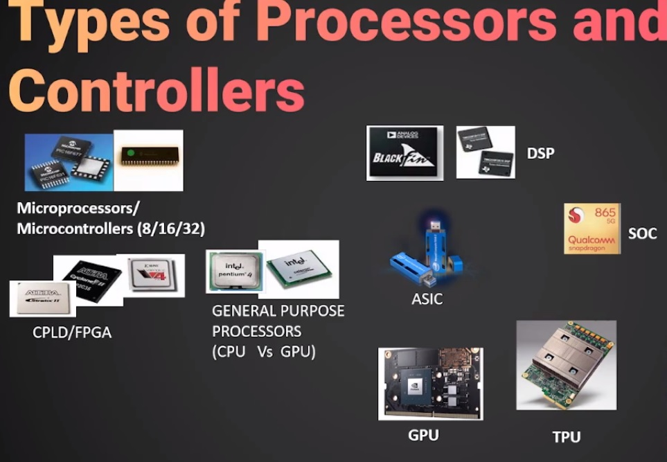
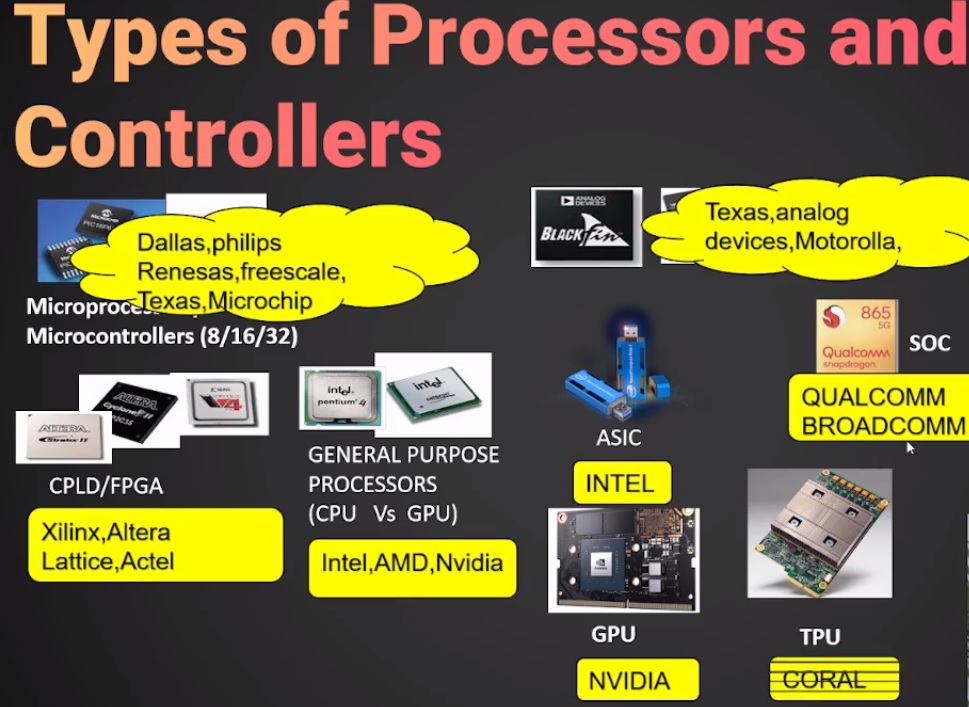
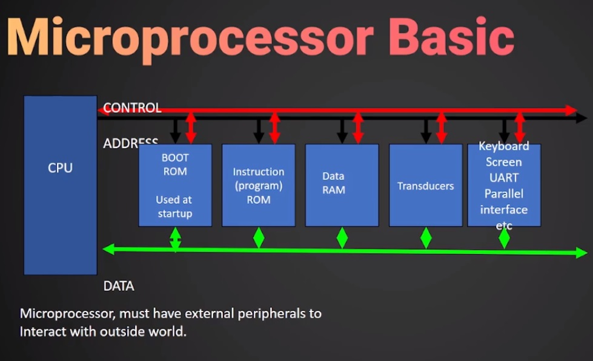
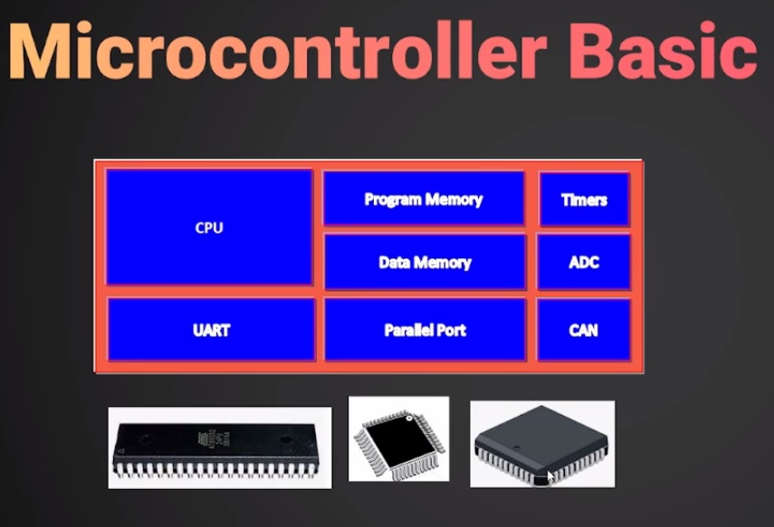

# **EmbeddedSystem**

## **Introduction**

### **Embedded System**

* It is  a combination of <ins> Both Hardware and Software with some mechanical parts </ins> to perform a <ins>specific task </ins> is called Embedded System.
* mobile is not is embedded system, it is a General purpose machine.
* Example: Printer, Induction Stove , Washing Machine

### **Classification of Embedded System**

1. Realtime Embedded System 
    * System which completes the TASK within Specific Time
      * Hard real time -- Nuclear Reactor
      * soft real time -- Game Controller
2. Network Embedded System 
    * Communicate with other Embedded Systems through ethernet or local area network or some other devices like routers.
3. Mobile Embedded System 
    * which act as a standalone
    * example : pacemakers (which has to operated by battery for a long time)

### **Types of Processors and Controllers for Embedded System**

1. Microprocessors/Microcontrollers - (8085/8086/8051)
2. DSP/DSC - (TMS320C6000/TSM320C2000)
3. CPLD/FPGA - Xilinx Coolrunner /ZYNQ
4. ASIC - Intel Movidius Stick , TGAM ,
5. SOC - ESP32-S3 , TI OMAP

### **Programming Languages you can choose for Embedded system**

1. ASM
2. C
3. Mixed C/ASM
4. Python
5. HDL
6. Graphical / VISUAL

### **List of companies Dominating processor core**

1. Intel 8051:
    * Processor Core: 8051
    * Company: Intel
    * Summary: Intel's 8051 microcontroller is known for its simplicity and versatility, making it widely used in embedded systems for diverse applications.

2. ARM:
    * Processor Cores: LPC2148, STM32 (ARM Cortex-M series)
    * Company: ARM
    * Summary: ARM, a British company, provides energy-efficient and scalable processor cores. The LPC2148 and STM32 microcontroller families utilize ARM Cortex-M cores, offering flexibility for various applications.

3. Microchip (PIC):
    * Processor Core: PIC
    * Company: Microchip Technology
    * Summary: Microchip's PIC microcontrollers are popular for their versatility and ease of integration, finding extensive use in embedded systems across different industries.

4. Tensilica - Cadence Design System (ESP32):
    * Processor Core: Tensilica Xtensa (used in ESP32)
    * Company: Cadence Design Systems
    * Summary: Tensilica, a division of Cadence, provides customizable processor cores. The Xtensa architecture, seen in the ESP32 microcontroller, allows developers to tailor performance and power characteristics to specific needs.

### **Application of ESD**

* Aerospace
* Automotive infotainment
* smart home
* industry 4.0 Automation
* Robotics
* Communication
* Audio , Video and
* Medical Imaging

### Convert an Idea to Prototype

### Embedded Development Life cycle

## **How To Choose a Right Processor**

> To Know about the manufactures of different processors and controllers you can visit [DigiLink](https://www.digikey.in/)

### MicroProcessor

* A microprocessor is a programmable integrated circuit (IC) that serves as the central processing unit (CPU) of a computer or electronic device. It is essentially the "brain" of a computer system, responsible for executing instructions and performing calculations. microprocessors require peripherals to interact with the external world and perform various tasks. Peripherals are additional devices and components that connect to the microprocessor to extend its capabilities and facilitate communication with the outside environment.
* Example : 8051

### MicroController 

* A microcontroller is a compact, integrated circuit (IC) that contains a processor core, memory, and programmable input/output peripherals. Unlike a general-purpose microprocessor, which is designed for tasks like running an operating system and handling a wide range of applications, a microcontroller is specifically intended for embedded systems and dedicated control applications.

### DSP (Digital Signal Processor)

* Digital Signal Processor is Mathematics on chip
* DSPs usually run applications with hard real-time constraints.
* DSPs usually process infinite continuous data streams
* MAC capability (Multiply-Accumulate operation)
* DSP Processors are Microprocessors designed for efficient mathematical manipulation of digital signals

#### why DSP Processor

* MicroControllers are control oriented , DSP are data path oriented .
* use a GPP Processor when the following are required:
  * Large Memory
  * Advanced operating system
* Use a DSP processor when the following are required:
  * Precision
  * cost saving
  * smaller size
  * low power consumption
  * processing of signals in realtime
  
> DSP processor uses Harvard architecture 

![[architecture]](./Images/architecture.jpg)

### FPGA VS CPLG

* FPGA - Field Programmable Gate Array, CPLD - Complex Programmable Logic Devices
* CPLD is control path oriented, FPGA is Data path oriented

![[CPLDarchitecture]](./Images/CPLDArchitecture.jpg)

![[FPGAarchitecture]](./Images/FPGAArchitecture.jpg)

![[Multicore]](./Images/multicore.jpg)

![[Package]](./Images/package.jpg)

## ARM

* Acorn RISC Machine -> Advanced RISC machine
* Founded in 1990
  * spun out of Acron Computers
* Designs the ARM range of RISC processor
* Licenses ARM core for Design Partners
  * ARM does not fabricate silicon on own
* Develops technology to assist with ARM Arch
  * Software Tools
  * Boards , Debug Hardware , Peripherials
  * Application software , BUs Architecture 

### why ARM

* Built in Architecture extensions
  * THUMB 2 - Greatly improved code density
  * DSP - signal process directly in the RISC core
  * jazelle - Java acceleration
  * Trustzone - Maximum security environment
* Core Performance
* Tools of Choice
* Wide Support
* Low Power Consumption

### ARM Processor VS ARM Architecture

#### ARM Architecture

* This refers to the design principles, instruction set, and specifications developed by ARM Holdings. The ARM architecture defines how instructions are executed, how data is processed, and how the processor interacts with other components in a system. It's like the blueprint or framework for building processors.
* Documented in the Architecture Reference Manual

#### ARM Processor

* An ARM processor is a specific implementation of the ARM architecture by a particular manufacturer. There are various ARM processors available from different companies like Qualcomm, Apple, Samsung, and others. Each manufacturer may customize the ARM architecture to some extent, adding their own features, optimizations, or additional instructions tailored to specific applications or performance requirements.
* Documented in the Processor Technical Reference Manual

In summary, the ARM architecture is the overarching design framework, while ARM processors are specific implementations of that architecture by different manufacturers, each with its own variations and optimizations.

### ARM Versions

<https://en.wikipedia.org/wiki/List_of_ARM_processors>

![[ARM-Versions]](./Images/ARMVersions.jpg)

* Cortex-A series (Application)
  * High performance processors capable of full Operating System (OS) support
  * Applications include smartphones, digital TV, smart books
* Cortex-R series (Real-time)
  * High performance and reliability for real-time applications;
  * Applications include automotive braking system, powertrains
* Cortex-M series (Microcontroller)
  * Cost-sensitive solutions for deterministic microcontroller applications
  * Applications include microcontrollers, smart sensors
* SecurCore series
  * High security applications
* Earlier classic processors including Arm7, Arm9, Arm