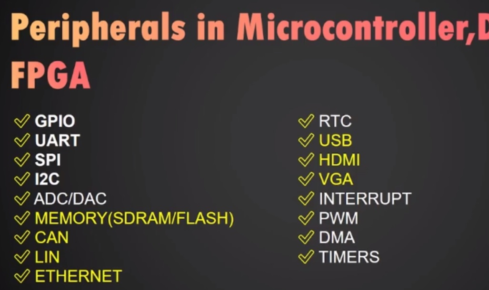
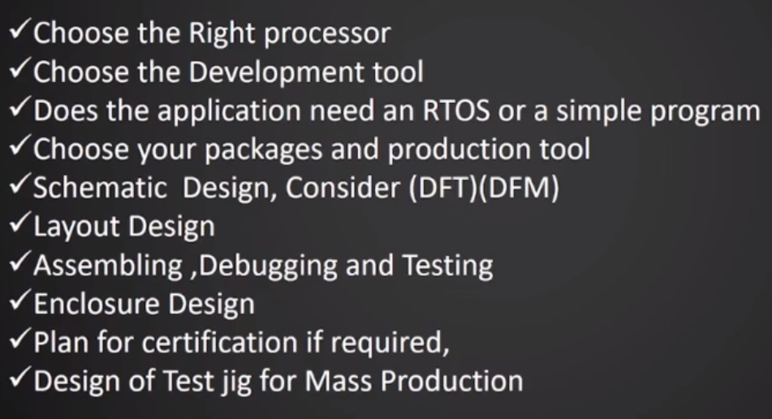
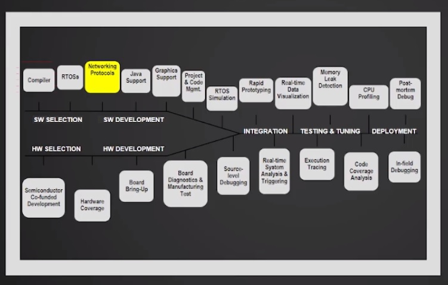

# **EmbeddedSystem**

## **Introduction**

### **Embedded System**

* It is  a combination of <ins> Both Hardware and Software with some mechanical parts </ins> to perform a <ins>specific task </ins> is called Embedded System.
* mobile is not is embedded system, it is a General purpose machine.
* Example: Printer, Induction Stove , Washing Machine

### **Classification of Embedded System**

1. Realtime Embedded System 
    * System which completes the TASK within Specific Time
      * Hard real time -- Nuclear Reactor
      * soft real time -- Game Controller
2. Network Embedded System 
    * Communicate with other Embedded Systems through ethernet or local area network or some other devices like routers.
3. Mobile Embedded System 
    * which act as a standalone
    * example : pacemakers (which has to operated by battery for a long time)

### **Types of Processors and Controllers for Embedded System**

1. Microprocessors/Microcontrollers - (8085/8086/8051)
2. DSP/DSC - (TMS320C6000/TSM320C2000)
3. CPLD/FPGA - Xilinx Coolrunner /ZYNQ
4. ASIC - Intel Movidius Stick , TGAM ,
5. SOC - ESP32-S3 , TI OMAP

### **Programming Languages you can choose for Embedded system**

1. ASM
2. C
3. Mixed C/ASM
4. Python
5. HDL
6. Graphical / VISUAL

### **List of companies Dominating processor core**

1. Intel 8051:
    * Processor Core: 8051
    * Company: Intel
    * Summary: Intel's 8051 microcontroller is known for its simplicity and versatility, making it widely used in embedded systems for diverse applications.

2. ARM:
    * Processor Cores: LPC2148, STM32 (ARM Cortex-M series)
    * Company: ARM
    * Summary: ARM, a British company, provides energy-efficient and scalable processor cores. The LPC2148 and STM32 microcontroller families utilize ARM Cortex-M cores, offering flexibility for various applications.

3. Microchip (PIC):
    * Processor Core: PIC
    * Company: Microchip Technology
    * Summary: Microchip's PIC microcontrollers are popular for their versatility and ease of integration, finding extensive use in embedded systems across different industries.

4. Tensilica - Cadence Design System (ESP32):
    * Processor Core: Tensilica Xtensa (used in ESP32)
    * Company: Cadence Design Systems
    * Summary: Tensilica, a division of Cadence, provides customizable processor cores. The Xtensa architecture, seen in the ESP32 microcontroller, allows developers to tailor performance and power characteristics to specific needs.

### **Application of ESD**

* Aerospace
* Automotive infotainment
* smart home
* industry 4.0 Automation
* Robotics
* Communication
* Audio , Video and
* Medical Imaging

### Convert an Idea to Prototype

### Embedded Development Life cycle

